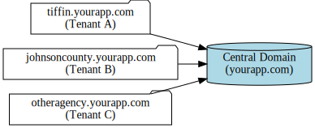
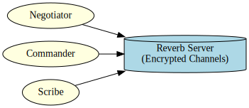
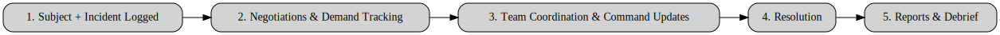

<div align="center">
  <picture>
    <source srcset="assets/PeaceProxyLogoDark.png" media="(prefers-color-scheme: dark)">
    
  </picture>
</div>

# 🚨 Crisis Negotiation & Incident Management Platform

A secure, real-time software platform built **for law enforcement negotiators, commanders, and crisis teams**. This
system helps agencies **manage negotiations, track demands, coordinate teams, and generate professional reports** that
support both operational success and post-incident review.

---

## 👮 Who We Serve

- **Crisis Negotiation Teams** – streamline communication, document demands, and coordinate responses in real time.
- **Command Staff** – gain situational awareness through live updates and structured reports.
- **Crisis Intervention Specialists** – access tools to better understand subjects and manage outcomes.
- **Post-Incident Review Boards** – receive detailed documentation for training, compliance, and legal proceedings.

---

## ✨ Key Capabilities

### 🔹 Real-Time Negotiation Support

- Secure chat between negotiators and command staff
- Private, group, and broadcast messaging channels
- End-to-end encrypted communication

### 🔹 Incident & Demand Tracking

- Log subjects, hostages, and incident details
- Track and update demands as they evolve
- Timestamped entries for courtroom-ready records

### 🔹 Reporting & Analysis

Generate comprehensive reports, including:

- Negotiation Summary
- Demand Tracking
- Communication Analysis
- Negotiator Performance
- Incident Logs
- Psychological Profiling
- Team Coordination
- Outcome Analysis
- Post-Incident Debrief
- Legal & Compliance Documentation

### 🔹 Team Coordination

- Role-based permissions (negotiator, commander, scribe, analyst)
- Presence tracking (who’s online, active, and engaged)
- Task assignment & accountability features

### 🔹 Advanced Tools

- **Barcode Signature Retrieval** – scan a code to securely apply stored signatures to official documents
- **Subject Image & File Management** – upload, store, and restrict access to sensitive files
- **Multi-Tenant Architecture** – each agency operates in its own secure, isolated environment

---

## 🛡️ Security First

We understand the sensitivity of crisis negotiations. The platform is built to meet law enforcement security needs:

- 🔐 **End-to-End Encryption** for sensitive communications
- 🛂 **Role & Permission Controls** to protect critical data
- 📜 **Audit Logs** to ensure transparency and accountability
- ☁️ **Secure Cloud Storage** for restricted documents and media

---

## 📊 Benefits for Agencies

- **Improved Coordination** – keep negotiators, commanders, and tactical units aligned
- **Reduced Risk** – accurate, real-time information prevents misunderstandings
- **Operational Efficiency** – less time lost to manual logging or scattered communication
- **Training & Learning** – past incidents become structured case studies
- **Courtroom Readiness** – every decision and demand is documented with precision

---

## 🚀 How Agencies Use It

1. **Before an Incident**
    - Prepare negotiation teams with tools, templates, and training scenarios.

2. **During an Incident**
    - Use real-time chat, demand tracking, and subject logs to guide negotiations.
    - Provide command staff with live updates and situational awareness.

3. **After an Incident**
    - Export structured reports for debriefing, legal documentation, and lessons learned.

---

## 📱 Access Anywhere

The platform is accessible from:

- Desktop and laptop browsers (optimized for command posts)
- Mobile devices (optimized for negotiators in the field)

---

## 🤝 Why Agencies Choose Us

- **Designed with negotiators in mind** – built in consultation with law enforcement professionals
- **Secure & Reliable** – leverages modern encryption and cloud infrastructure
- **Scalable** – supports small teams or multi-agency task forces
- **Future-Focused** – roadmap includes AI-assisted negotiation insights and mobile-first improvements

---

## 📜 Licensing

This software is proprietary and licensed directly to law enforcement agencies.  
For demos, licensing, or training inquiries, please contact our team.

---

# 🗂️ Visual Overview

### 📍 Multi-Tenant Agency Setup

Each agency has its **own subdomain** and isolated data environment.



*(Example: `tiffin.yourapp.com`, `johnsoncounty.yourapp.com`)*

---

### 🔄 Real-Time Communication Flow

Negotiators, commanders, and scribes collaborate securely through **encrypted real-time channels**.



---

### 📑 Incident Lifecycle

Incidents move through a **structured workflow**:



1. Subject + Incident Logged
2. Negotiations & Demand Tracking
3. Team Coordination & Command Updates
4. Resolution
5. Reports & Debrief

---

# ⚙️ Developer Appendix

This section is intended for **agency IT teams** and **technical staff**.

---

## 🛠️ Tech Stack

- **Backend:** Laravel 12
- **Frontend:** TailwindCSS 4, Alpine.js, TALLStack UI
- **Real-Time:** Laravel Reverb
- **Components:** Livewire Volt (anonymous class-based)
- **File Storage:** Amazon S3 (public + private buckets)
- **Image Processing:** Spatie Image
- **Database:** MySQL (single DB, multi-tenant scoped models)
- **Encryption:** End-to-End Message Encryption

---

## 🚀 Installation

### Prerequisites

- PHP 8.3+
- Composer 2.x
- Node.js 20+ & npm
- MySQL 8+
- Redis (for queues & broadcasting)
- Laravel Herd (recommended for local dev)

### Setup

```bash
# Clone repository
git clone https://github.com/your-organization/negotiation-platform.git
cd negotiation-platform

# Install dependencies
composer install
npm install && npm run build

# Environment setup
cp .env.example .env
php artisan key:generate

# Run migrations & seeders
php artisan migrate --seed

# Start development servers
php artisan reverb:start
php artisan serve

